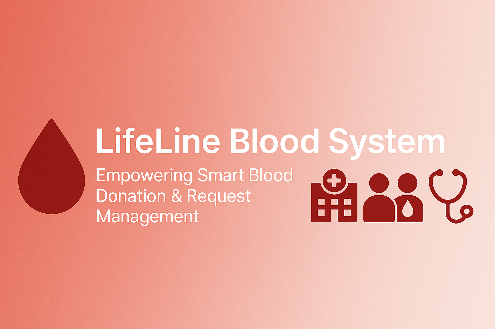
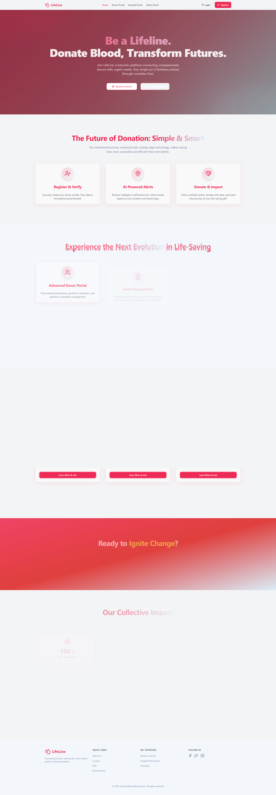

# 🩸 LifeLine Blood System

 

> A modern web-based Blood Bank Management System that simplifies blood donation and transfusion by connecting donors, recipients, and hospitals in real time.

## 🚀 Live Demo

🌐 [Check Live App](https://lifeline-blood-system.netlify.app/) <!-- Update with live link if hosted -->

---

## 📌 Table of Contents

- [About the Project](#about-the-project)
- [Features](#features)
- [Tech Stack](#tech-stack)
- [Screenshots](#screenshots)
- [Getting Started](#getting-started)
- [Project Structure](#project-structure)
- [Contributing](#contributing)
- [License](#license)
- [Contact](#contact)

---

## 🩺 About the Project

**LifeLine Blood System** is a full-stack application designed to make the blood donation process more transparent and efficient. It offers modules for donors, recipients, and hospitals/admins to manage and track blood requests, donations, and inventory.

---

## ✨ Features

- 🧑‍💼 **Donor & Recipient Registration/Login**
- 🩸 **Blood Request & Donation Tracking**
- 📍 **Find Nearby Donors/Hospitals**
- 📊 **Admin Dashboard for Managing Inventory**
- 🔐 **Authentication & Authorization**
- 📅 **Donation History & Upcoming Events**
- 📫 **Email Notifications for Requests**

---

## 🛠 Tech Stack

### Frontend
- HTML5, CSS3, JavaScript
- Bootstrap

### Backend
- PHP
- MySQL

### Other Tools
- XAMPP / WAMP (for local server setup)
- phpMyAdmin (for database management)

---

## 📸 Screenshots

<!-- Replace with your own screenshots -->
| Dashboard | Admin Panel | Donation Form |hostpital portan|
|----------|-------------|----------------|----------------|
|  |  |  |

---

## 🧑‍💻 Getting Started

Follow these instructions to set up the project locally.

### Prerequisites

- PHP >= 7.0
- MySQL Server
- XAMPP / WAMP

### Installation Steps

1. **Clone the Repository**
   ```bash
   git clone https://github.com/AMANPUSHP23/LifeLine-Blood-System.git

🤝 Contributing
Contributions are welcome! Follow these steps:

Fork the repository

Create a new branch: git checkout -b feature-name

Commit your changes: git commit -m "Added feature"

Push to the branch: git push origin feature-name

Create a pull request

📜 License
This project is licensed under the MIT License. See the LICENSE file for details.

📧 Contact
Aman Pushp
📩 amanpushp2001@gmail.com

💖 Show Your Support
If this project helped you, leave a ⭐ on G[🔗 GitHub](https://github.com/AMANPUSHP23)
 to inspire me and help others discover it!

